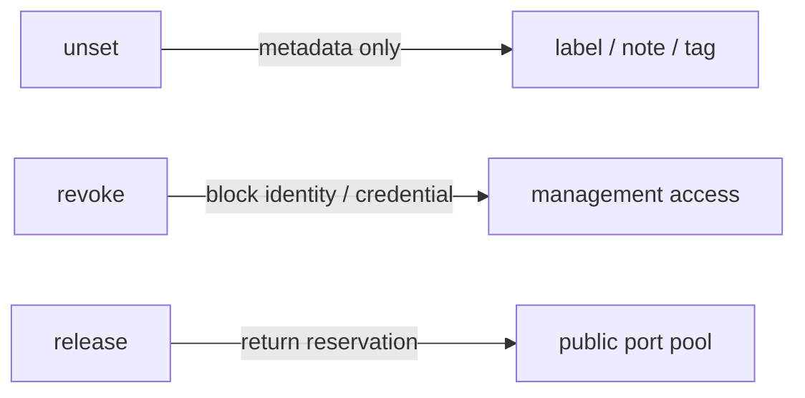

# CLI Reference

This page documents the **stable v2.2.1** CLI baseline. Mutable `main` may contain later development or docs-only changes, so field procedures should continue to use the immutable v2.2.1 release contract.

## Grammar

```text
<verb> <resource> [target] [property] [value]
```

Host role decides which commands appear in Tab/help. There is no separate `server ...` / `client ...` top-level namespace.

## Interactive keys

```text
Tab   show/complete valid next tokens
?     detailed contextual explanation
Enter execute
↑/↓   session-only history
```

Tab does not execute commands. `drlink` history is not written to disk.

## Client selector

The canonical selector is **CLIENT ID**: immutable short machine identity. Changing label, note, tags, or hostname never changes CLIENT ID.

- `show clients` prints CLIENT ID first.
- Tab completes CLIENT ID.
- A unique label/hostname can be typed manually.
- Ambiguous selectors fail closed.
- `user@host:port` is not a client selector.

## Show

```text
show status
show version
show clients
show client <ID>
show client <ID> services
show client <ID> tags
show enrollments
show audit
show upstream
show services
show info
```

`status` and `version` remain compatibility shortcuts for the `show` form.

## Set

Server:

```text
set client <ID> label <value>
set client <ID> note <value>
set client <ID> tag <key> <value>
set installer-url <url>
set server hostname <fqdn>
```

Client:

```text
set service <service-id> target-host <host>
set service <service-id> target-port <port>
set service <service-id> ssh-user <user>
set service <service-id> name <value>
```

Service IDs are immutable. Client-side pending changes become live after `apply`.

## Unset

```text
unset client <ID> label
unset client <ID> note
unset client <ID> tag <key>
unset server hostname
```

`unset` removes metadata; it does not release public ports or change identity.

## Create / add

```text
create zero-touch
create enrollment [--one-line] [--ssh --ssh-user USER --label NAME]
create enrollments --count N
create enrollments --csv clients.csv
create backup [path]
add service [--preset ssh|http|https|custom] ...
```

`create zero-touch` is the recommended everyday onboarding path.

## Enable / disable / apply / discard

```text
enable service <service-id>
disable service <service-id>
apply
discard
```

Disabling a service keeps the public-port reservation. `apply` does not release server ports.

## Revoke / release / restore

```text
revoke client <ID>
revoke enrollment <ID>
release service <ID> <service-id>
release client <ID>
restore backup <path>
```



These are never aliases. There is intentionally no ambiguous `delete client` command.

## Update

```text
update project [--check]
update relay-engine [--check]
```

The bundled relay engine remains pinned to the tested project version. `show upstream` is informational.

## Other

```text
doctor
help
help show
help set client
help legacy
?
show ?
set client <ID> ?
menu
history
clear
exit
```

## Stable enrollment states

`show enrollments` can represent enrollment records in normalized lifecycle states such as:

```text
pending
bound
completed
expired
revoked
```

Secrets are never printed by `show`, Tab, or help output.

<Note>
  Stable v2.2.1 includes the qualified enrollment lifecycle controls and bootstrap-hostname / Short URL support documented here. Mutable `main` may contain later changes; use the immutable v2.2.1 contract for field procedures.
</Note>

## Compatibility aliases

| Alias | Canonical |
| --- | --- |
| `clients` | `show clients` |
| `client` / `client-info` | `show client` |
| `client-set` / `edit-client` | `set client` / `unset client` |
| `enroll` / `create-client` | `create enrollment` |
| `enroll-bulk` | `create enrollments` |
| `enrollments` | `show enrollments` |
| `enrollment-revoke` | `revoke enrollment` |
| `revoke` / `revoke-client` | `revoke client` |
| `release-service` | `release service` |
| `release-client` | `release client` |
| `project-update` / `client-update` | `update project` |
| `relay-engine-update` / `server-update` | `update relay-engine` |
| `backup` | `create backup` |
| `restore PATH` | `restore backup PATH` |
| `upstream` | `show upstream` |
| `audit` | `show audit` |
| `services` / `manage` / `info` | `show services` / `add`\+`set service` / `show info` |
| `status` / `version` | `show status` / `show version` |
