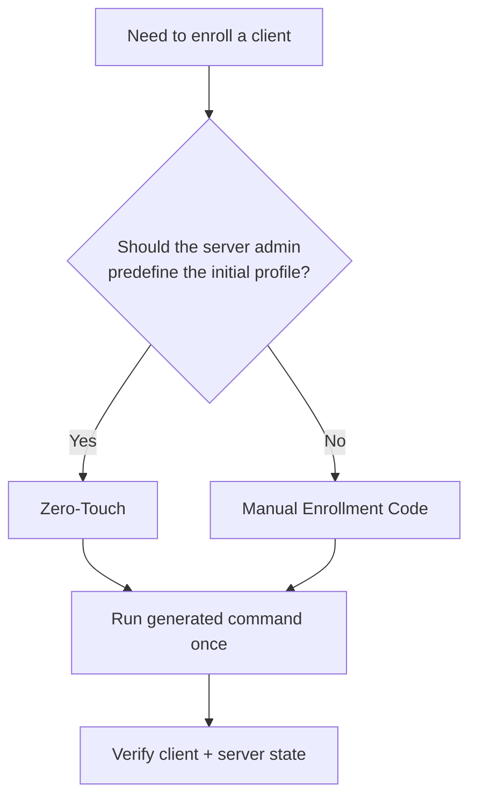
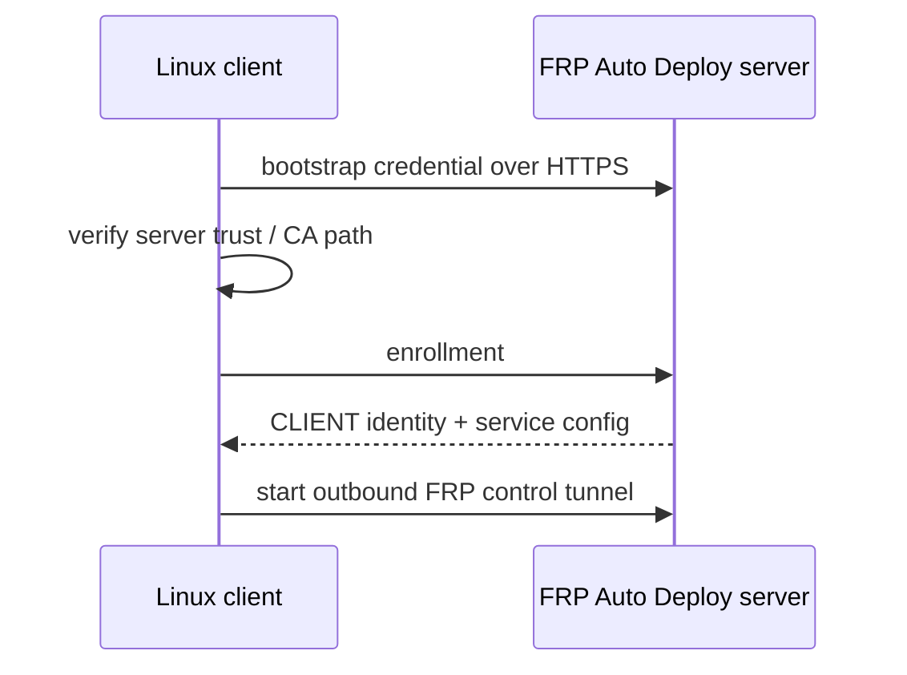

# Linux Client

Linux/systemd is the current stable client scope for FRP Auto Deploy.

## What the client needs

Before enrollment, confirm:

- `sudo`/root access is available for installation
- the client can make outbound connections to the FRP server public endpoints
- any service you want to publish already exists and is reachable from the client
- for SSH, the SSH user already exists and `sshd` is running

FRP Auto Deploy does not create operating-system users, passwords, SSH keys, or application services.

## Choose enrollment method

| Method | Best when | Who chooses initial services? |
| --- | --- | --- |
| **Zero-Touch** | server admin wants a ready-to-run command | server admin |
| **Manual Enrollment Code** | remote operator should choose services interactively | remote operator |



## Recommended: Zero-Touch

For the easiest interactive server workflow:

```bash
sudo frpctl
```

Then:

```text
create zero-touch
```

For an explicit SSH profile:

```bash
sudo frpctl create enrollment \
  --one-line \
  --ssh \
  --ssh-user aella \
  --label branch-a
```

Replace `aella` with an SSH account that already exists on the target machine. Run the **exact generated command** on the client; do not reconstruct the bootstrap payload manually.

## Manual Enrollment Code

On the server:

```bash
sudo frpctl create enrollment
```

Run the generated client bootstrap command and enter the short-lived Enrollment Code when prompted. The installer can then guide the remote operator through service selection.

## What happens during enrollment



## Verify on the client

```bash
sudo frpctl show version
sudo frpctl show status
sudo frpctl show services
sudo frpctl show info
sudo frpctl doctor
```

## Verify on the server

```bash
sudo frpctl show clients
sudo frpctl show enrollments
sudo frpctl show client <CLIENT-ID>
sudo frpctl show client <CLIENT-ID> services
```

The client receives a persistent CLIENT ID. Normal reboots, supported service edits, and normal stable project updates do not require a new enrollment.

## Changing services later

Client-side service edits are staged:

```text
add service
set service <service-id> target-host <host>
set service <service-id> target-port <port>
apply
```

Use `discard` before `apply` if you want to throw away pending changes.

## Important lifecycle rule

```text
client uninstall != server release
```

Removing local client software does not automatically free the server's public-port reservations. See [Lifecycle Semantics](/operations/lifecycle).
