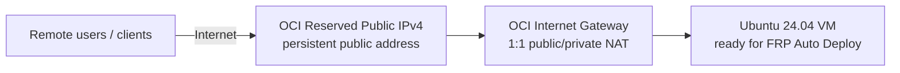
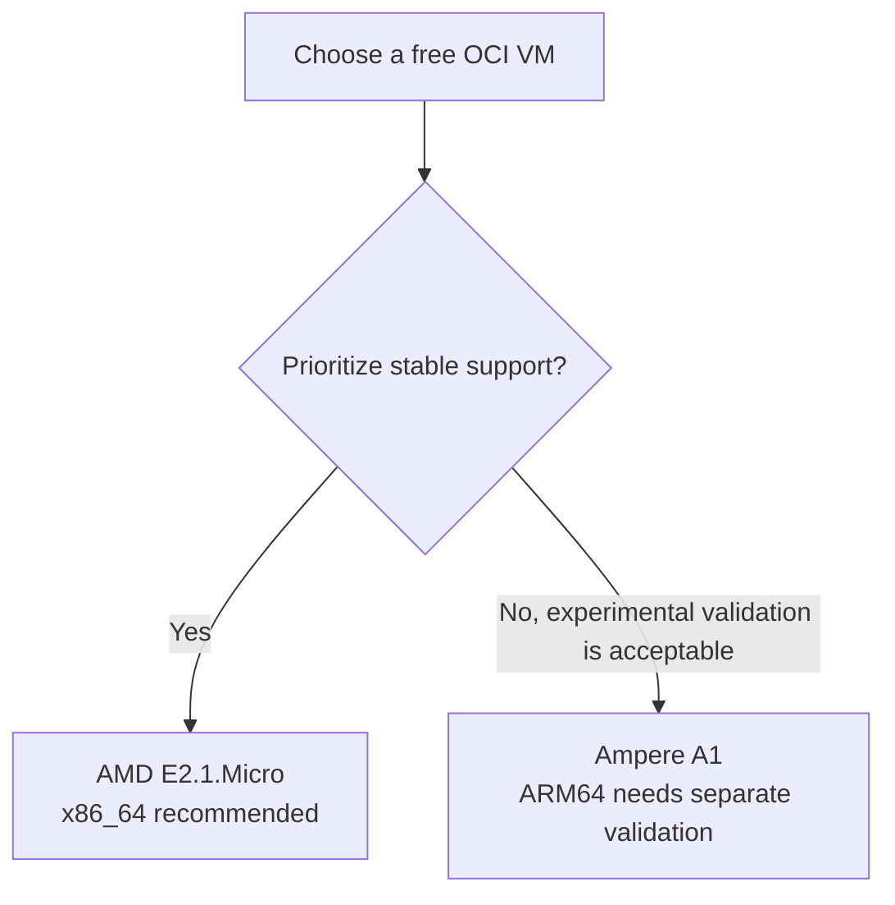
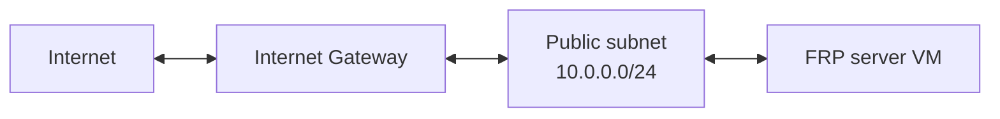
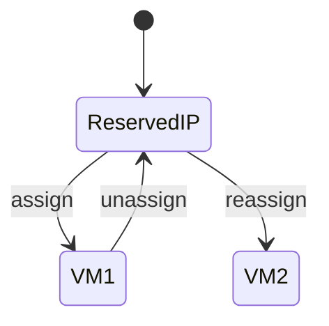
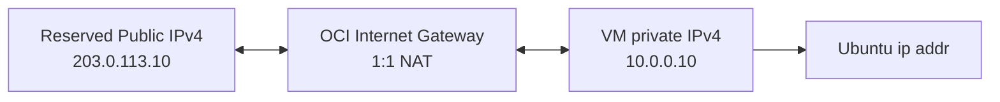
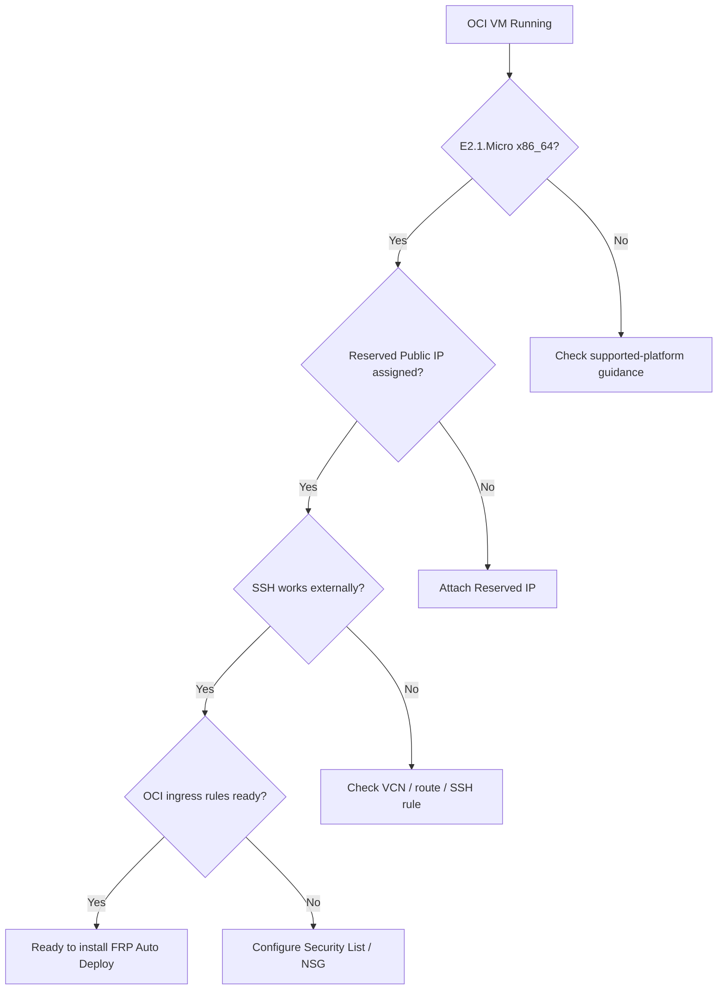

# OCI Free Tier Server Preparation

FRP Auto Deploy needs a **publicly reachable server entry point**. If you do not have a static public IP at home or the office, and you do not want to pay for a separate VPS, an Oracle Cloud Infrastructure (OCI) Always Free-eligible Linux VM can be a practical FRP server host.

This page stops **before installing FRP Auto Deploy**. The goal is to prepare the Linux server, networking, SSH access, and persistent public IPv4 address.



<Check>
  A DNS name is optional. You can start with only the reserved public IP and the assigned FRP service ports, then add a hostname later.
</Check>

## What this solves

| Concern | OCI approach |
| --- | --- |
| No static public IP | Use an OCI **Reserved Public IPv4** |
| No spare public Linux server | Use an **Always Free-eligible VM** |
| No domain name | Use the public IP directly at first |
| Worried the address will change | Reserved Public IP exists independently of the instance lifecycle |
| Home-router NAT is difficult | OCI provides a public subnet and Internet Gateway |

## Recommended configuration

For the current FRP Auto Deploy stable support boundary, use this conservative configuration:

| Item | Recommended value | Why |
| --- | --- | --- |
| Region | **Tenancy Home Region** | Always Free Compute must be created in the home region |
| Shape | **VM.Standard.E2.1.Micro (AMD/x86_64)** | Always Free eligible and aligned with the stable x86_64 Linux path |
| Image | **Ubuntu 24.04 LTS x86_64** | Matches the real-VM validation baseline |
| Boot volume | Default size | Keeps storage simple and within Always Free allocation |
| Subnet | **Public subnet** | Required for a public IPv4 assignment |
| Public IPv4 | **Reserved** | Persistent address independent of VM lifecycle |
| SSH | TCP/22 from your admin IP only | Initial administration |
| FRP Direct | TCP/443, 6099, and service ports | Default deployment path |

<Warning>
  OCI Free Tier policies and tenancy limits can change. Before creating resources, confirm the **Always Free Eligible** label and the cost estimate shown in the OCI Console. Capacity also varies by home region.
</Warning>

## Why E2.1.Micro instead of Ampere A1?

OCI also offers Arm-based `VM.Standard.A1.Flex` under its Always Free program. FRP Auto Deploy, however, does **not currently advertise native ARM64 systemd as field-validated stable support**.



For a first-time deployment, use **x86_64 E2.1.Micro** when capacity is available.

## 1. Create the OCI account and choose the Home Region

Choose the **Home Region** carefully when creating the tenancy. Oracle documents that Always Free Compute instances must be created in that home region.

If OCI reports `Out of host capacity`, try another Availability Domain when possible or try again later.

<Note>
  OCI account registration may require a mobile number and payment-card verification. Always Free resources are distinct from time-limited Free Trial credits, but the OCI Console at creation time is the final source for eligibility and billing status.
</Note>

## 2. Create a VCN with Internet connectivity

In the OCI Console:

```text
Networking
→ Virtual Cloud Networks
→ Start VCN Wizard
→ VCN with Internet Connectivity
```

Simple example:

```text
VCN CIDR          10.0.0.0/16
Public subnet     10.0.0.0/24
Private subnet    10.0.1.0/24
DNS resolution    Enabled
```

The wizard normally creates the required Internet-facing network components.



Place the FRP server VM in the **public subnet**.

## 3. Create the Ubuntu VM

In the OCI Console:

```text
Compute
→ Instances
→ Create instance
```

### Image

Recommended:

```text
Ubuntu 24.04 LTS
Architecture: x86_64 / AMD
```

### Shape

```text
VM.Standard.E2.1.Micro
Confirm the Always Free Eligible label
```

### Networking

- Select the VCN you created.
- Select the **public subnet**.
- Let OCI assign the primary private IPv4 automatically.
- Prefer **Do not assign a public IPv4 address** at this step.

The next step attaches a Reserved Public IP directly, avoiding a temporary ephemeral IP first.

### SSH key

Upload/paste your existing public key, or let OCI generate a key pair.

<Warning>
  If OCI generates the key pair, store the private key safely. Do not assume you can download the same private key later.
</Warning>

## 4. Create a Reserved Public IPv4

In the OCI Console:

```text
Networking
→ IP management
→ Reserved public IPs
→ Reserve public IP address
```

Example:

```text
Name          frp-server-ip
Compartment   <your compartment>
IP source     Oracle pool (default)
```

Unlike an ephemeral public IP, a Reserved Public IP is a persistent regional object. It can be unassigned and reassigned to another compatible private IP in the same region.



## 5. Attach the Reserved Public IP to the VM

Oracle's current Console flow is:

```text
Compute
→ Instances
→ <FRP server instance>
→ Networking
→ Attached VNICs
→ <Primary VNIC>
→ IP administration
→ <Primary private IP> ... → Edit
→ Public IP type: Reserved public IP
→ Select Existing Reserved IP Address
→ choose frp-server-ip
→ Update
```

<Note>
  If the VNIC private IP already has an ephemeral or reserved public IP, remove/unassign it first. OCI allows only one public-IP object on that private IP at a time.
</Note>

## 6. Why does Linux only show a private IP?

OCI public IPv4 is not configured directly on the guest OS NIC. OCI provides one-to-one NAT between the public IPv4 and the VNIC's private IPv4.



So this is normal:

```bash
ip addr
```

shows `10.x.x.x`, while the persistent public address is visible in the OCI Console.

## 7. Configure OCI Security List / NSG ingress

FRP Auto Deploy does **not** modify OCI Security Lists or NSGs for you.

### Safe starting rules

| Purpose | Protocol | Port | Recommended source |
| --- | --- | ---: | --- |
| SSH administration | TCP | 22 | **your admin public IP/32** |
| FRP control (Direct) | TCP | 443 | required client networks or Internet |
| Enrollment / management (Direct) | TCP | 6099 | required client networks or Internet |
| Published services | TCP | 6000-6098 | only sources that need access |

<Warning>
  Avoid leaving SSH TCP/22 open to `0.0.0.0/0` longer than necessary. Restrict it to your administrator public IP `/32` when practical.
</Warning>

If you want automatic service-port allocation without updating OCI rules every time, you can allow `6000-6098`. In stricter environments, open only the ports currently assigned to services and update firewall policy as services are added.

### Enterprise single-443

Typical public ingress:

```text
TCP 443         enrollment + FRP control frontend
TCP 6000-6098   published services
```

Backend `6099` and `7000` remain loopback-only and must not be exposed to the Internet.

## 8. SSH to Ubuntu

The default account for OCI Ubuntu images is typically `ubuntu`.

```bash
chmod 600 <your-private-key>
ssh -i <your-private-key> ubuntu@<RESERVED_PUBLIC_IP>
```

Verify the host:

```bash
uname -m
cat /etc/os-release
systemctl --version
openssl version
```

Recommended result:

```text
Architecture   x86_64
OS             Ubuntu 24.04 LTS
PID 1          systemd
```

## 9. Perform basic Linux preparation

Before installing FRP Auto Deploy:

```bash
sudo apt update
sudo apt -y upgrade
sudo apt -y install curl ca-certificates
```

Check time synchronization:

```bash
timedatectl status
```

Large clock drift can cause TLS/enrollment problems.

Check the local firewall too:

```bash
sudo ufw status
```

If UFW is active, both the OCI network policy **and** UFW must allow the required ports. If UFW is inactive, this guide does not require enabling it just for FRP Auto Deploy.

## 10. Final readiness check



Checklist:

- [ ] VM is in the **Home Region**
- [ ] Shape is marked **Always Free Eligible**
- [ ] Ubuntu 24.04 x86_64 is used
- [ ] Public subnet + Internet Gateway are present
- [ ] Reserved Public IPv4 is attached
- [ ] SSH private key is safely stored
- [ ] External SSH connection succeeds
- [ ] OCI Security List/NSG is ready
- [ ] `curl` and CA certificates are installed
- [ ] System clock is healthy

Continue to [Server Installation](/getting-started/server-installation).

## Free-operation caveats

### Idle Always Free instance reclamation

Oracle's current Always Free documentation states that **idle compute instances may be reclaimed**. It describes a 7-day period of low CPU/network utilization, with memory utilization also considered for A1 shapes.

A rarely used FRP gateway can therefore be affected by the provider's idle policy.

<Warning>
  If remote-access availability is business-critical, evaluate the availability tradeoff of Free Tier. Do not generate meaningless workload simply to defeat an idle-reclamation policy.
</Warning>

### Free Tier limits can change

OCI documentation and product pricing pages can change over time. This guide intentionally recommends the **x86_64 E2.1.Micro path marked Always Free Eligible in the Console** and treats the live Console eligibility/cost estimate as the final check before provisioning.

## Next steps

<CardGroup cols={2}>
  <Card title="Install the FRP Server" icon="server" href="/getting-started/server-installation">
    Install the stable FRP Auto Deploy server on the prepared OCI Ubuntu VM.
  </Card>
  <Card title="Firewall & NAT" icon="shield-halved" href="/deployment/firewall-nat">
    Understand public IP, NAT, and service-port behavior in more depth.
  </Card>
</CardGroup>

## Official OCI references

- [Oracle Cloud Always Free Resources](https://docs.oracle.com/en-us/iaas/Content/FreeTier/freetier_topic-Always_Free_Resources.htm)
- [Launching Your First Linux Instance](https://docs.oracle.com/en-us/iaas/Content/Compute/tutorials/first-linux-instance/overview.htm)
- [Public IP Addresses](https://docs.oracle.com/en-us/iaas/Content/Network/Tasks/managingpublicIPs.htm)
- [Creating a Reserved Public IP](https://docs.oracle.com/en-us/iaas/Content/Network/Tasks/reserved-public-ip-create.htm)
- [Assigning a Reserved Public IP to a Private IP](https://docs.oracle.com/en-us/iaas/Content/Network/Tasks/reserved-public-ip-assign.htm)
