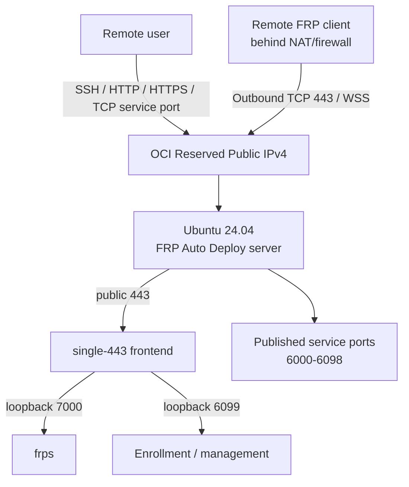

# OCI Free Tier FRP Server

This guide takes you from an empty OCI tenancy to a working **FRP Auto Deploy v2.2.1** server and the first SSH client. It reuses the actual OCI Console screenshots from the original `frp.datarelay.run` deployment guide, while updating all FRP commands and product behavior to the current stable release.

<Note>
  OCI Console labels, Free Tier eligibility, capacity, and pricing can change. Treat the current Console's **Always Free Eligible** indicator and cost estimate as the final source before creating resources.
</Note>

## What you will build



For this OCI walkthrough we use **Enterprise single-443** because it gives a simple public policy:

| Public ingress | Purpose |
| --- | --- |
| TCP 22 | OCI server administration; restrict to your admin IP `/32` |
| TCP 443 | FRP control over WSS + enrollment/management HTTPS |
| TCP 6000-6098 | Published client services; restrict further when practical |
| TCP 6099 | **Do not expose** in single-443 |
| TCP 7000 | **Do not expose** in single-443 |

Direct mode is also fully supported. In Direct mode, TCP 6099 is a separate public enrollment/management endpoint.

## 10-minute map

| Step | OCI / FRP action | Value used in this guide |
| --: | --- | --- |
| 1 | Create VCN | `frp-vcn` / `10.0.0.0/16` |
| 2 | Internet Gateway + route | `0.0.0.0/0` → Internet Gateway |
| 3 | Create public subnet | `frp-public-subnet` / `10.0.0.0/24` |
| 4 | Security List | admin SSH, `443`, `6000-6098` |
| 5 | Create VM | Ubuntu 24.04 x86_64 / `VM.Standard.E2.1.Micro` when eligible |
| 6 | Public address | attach a **Reserved Public IPv4** |
| 7 | SSH | `ubuntu@<RESERVED-IP>` |
| 8 | Install FRP Auto Deploy | immutable `v2.2.1` |
| 9 | Verify | `frpctl doctor` + listener checks |
| 10 | Add first client | current one-line Zero-Touch enrollment |

# Part I — Build the OCI network and VM

## 1. Open Virtual Cloud Networks

From the OCI Home page, enter **Networking → Virtual Cloud Networks**. The original Console screenshots below show the landmarks and the exact values used in the field deployment.

## 2. Create the VCN, Internet Gateway, route, subnet, and ingress rules

Use these values:

```text
VCN name             frp-vcn
VCN IPv4 CIDR         10.0.0.0/16
Internet Gateway      frp-internet-gateway
Default route         0.0.0.0/0 -> Internet Gateway
Public subnet         frp-public-subnet
Public subnet CIDR    10.0.0.0/24
Subnet type           Regional / Public
```


The screenshots cover the same sequence as the original guide:

1. **Virtual Cloud Networks → Create VCN**
2. create `frp-vcn` with `10.0.0.0/16`
3. **Gateways → Create Internet Gateway**
4. **Routing → Default Route Table → Add Route Rules**
5. route `0.0.0.0/0` to `frp-internet-gateway`
6. **Subnets → Create Subnet**
7. create `frp-public-subnet` with `10.0.0.0/24`, using the VCN default route table
8. **Security → Default Security List → Add Ingress Rules**

### Recommended single-443 ingress

| Protocol | Destination port | Source | Purpose |
| --- | --: | --- | --- |
| TCP | 22 | **your admin public IP/32** | SSH administration |
| TCP | 443 | client networks or `0.0.0.0/0` if required | WSS control + enrollment/management |
| TCP | 6000-6098 | only networks/users that need the services | published services |

<Warning>
  In **single-443** mode, do not create public OCI ingress or DNAT for **6099** or **7000**. They are internal loopback backends. Also do not blindly copy a broad `All Protocols` rule from a generic OCI tutorial.
</Warning>

If you do not want the whole `6000-6098` range exposed, allow only the service ports that are actually assigned, and constrain source CIDRs where possible.

## 3. Create the Ubuntu compute instance

Recommended values for this walkthrough:

```text
Name           frp-server
Image          Canonical Ubuntu 24.04 LTS x86_64
Shape          VM.Standard.E2.1.Micro (when Console marks it eligible/free)
VCN            frp-vcn
Subnet         frp-public-subnet
Boot volume    default
```


Important points from the original deployment:

- choose the existing `frp-vcn`
- choose `frp-public-subnet`
- allow OCI to assign the **private IPv4** automatically
- turn off **Automatically assign public IPv4 address** for the final persistent-IP design
- generate/download or upload an SSH public key
- if OCI generated the key pair, store the private key securely; do not assume it can be downloaded again later
- keep the boot volume simple unless you have another storage requirement

<Warning>
  `VM.Standard.E2.1.Micro` availability and Free Tier treatment are tenancy/region dependent. If the Console does not show it as eligible at creation time, do not assume this guide makes it free.
</Warning>

## 4. Attach a Reserved Public IPv4

After the instance exists:

```text
Compute
→ Instances
→ frp-server
→ Networking
→ Primary / Attached VNIC
→ IP administration
→ Primary private IPv4
→ Edit
```

If an ephemeral public IP is currently attached, select **No public IP** first. Then edit again and choose:

```text
Public IP type        Reserved public IP
Option                Create new Reserved IP Address
Name                  frp-reserved-public-ip
```


A Reserved Public IP is the address you should treat as the persistent public entry point for FRP Auto Deploy. OCI performs the public/private mapping outside the Ubuntu guest, so `ip addr` on the VM normally shows the private `10.x.x.x` address rather than the public address.

## 5. Test SSH access

For OCI Ubuntu images the default account is normally `ubuntu`:

```bash
chmod 600 ~/Downloads/<private-key-file>
ssh -i ~/Downloads/<private-key-file> ubuntu@<RESERVED-PUBLIC-IP>
```

Then verify the host:

```bash
uname -m
cat /etc/os-release
systemctl --version
```

Expected for this guide:

```text
Architecture   x86_64
OS             Ubuntu 24.04 LTS
PID 1          systemd
```

# Part II — Install FRP Auto Deploy v2.2.1

## 6. Prepare only the packages you need

```bash
sudo apt update
sudo apt -y install curl ca-certificates
```

Check time and the host firewall before installation:

```bash
timedatectl status
sudo ufw status
sudo iptables -S INPUT
```

<Warning>
  The older field notes contained an environment-specific procedure that flushed the Ubuntu `INPUT` chain. **Do not blindly run `iptables -F` or change the default INPUT policy just for FRP Auto Deploy.** OCI Security Lists/NSGs and the Ubuntu host firewall are separate security boundaries; configure each deliberately for your environment.
</Warning>

## 7. Install the immutable stable release

```bash
curl -fsSL \
  https://raw.githubusercontent.com/datarelay-labs/frp-auto-deploy/v2.2.1/dist/bootstrap-server.sh \
  | sudo bash
```

For this OCI walkthrough, choose **Enterprise single-443** when the installer asks for topology. Conceptually the result is:

```text
Public host                  <RESERVED-PUBLIC-IP or DNS>
Deployment mode              Enterprise single-443
Public control               TCP 443
FRP backend                  127.0.0.1:7000
Public enrollment/management HTTPS 443
Allocator backend            127.0.0.1:6099
Published service range      TCP 6000-6098
Pinned FRP                   0.71.0
Project                       2.2.1
```

Do not copy the v2.1.0 environment-variable installation command from the old guide. The current field path is the immutable **v2.2.1** installer above and its current interactive questions.

## 8. Verify the server

```bash
sudo frpctl show version
sudo frpctl show status
sudo frpctl doctor
```

For single-443, also inspect the listeners:

```bash
sudo ss -lntp | grep -E ':(443|6099|7000)\b'
```

The important exposure model is:

```text
0.0.0.0:443       public frontend
127.0.0.1:7000    frps backend
127.0.0.1:6099    allocator backend
```

From another machine on the Internet:

```bash
nc -vz -w 3 <RESERVED-PUBLIC-IP> 443
```

`frpctl doctor` should have no blocking failure before onboarding clients.

## 9. Verify reboot persistence

```bash
sudo reboot
```

After reconnecting:

```bash
sudo frpctl show status
sudo frpctl doctor
sudo ss -lntp | grep -E ':(443|6099|7000)\b'
```

The services and listener topology should return without re-enrollment or manual reconstruction.

# Part III — Connect the first client

## 10. Generate a Zero-Touch SSH enrollment

On the FRP server:

```bash
sudo frpctl create enrollment \
  --one-line \
  --ssh \
  --ssh-user <EXISTING-CLIENT-USER> \
  --label <CLIENT-LABEL>
```

The command printed by the server contains a short-lived, one-time bootstrap credential. **Copy the exact generated command** to the remote client instead of reconstructing it manually.

<Warning>
  Treat a generated Zero-Touch command as sensitive until it expires or is used. Do not paste a live ticket into public chat, documentation, or issue trackers.
</Warning>

On the client, run the generated line. FRP Auto Deploy does not create the SSH user or `sshd`; they must already exist.

## 11. Verify the client and connect

On the client:

```bash
sudo frpctl show version
sudo frpctl show status
sudo frpctl show services
sudo frpctl doctor
```

On the server:

```bash
sudo frpctl show clients
sudo frpctl show client <CLIENT-ID>
sudo frpctl show client <CLIENT-ID> services
```

Then use the assigned persistent public service port:

```bash
ssh -p <PUBLIC-SERVICE-PORT> <CLIENT-USER>@<RESERVED-PUBLIC-IP>
```

The **client does not manually choose the public port**. The FRP server allocates and persists the service reservation.

# Final checklist

- [ ] VCN `10.0.0.0/16` exists
- [ ] Internet Gateway exists
- [ ] default route has `0.0.0.0/0 → Internet Gateway`
- [ ] public subnet `10.0.0.0/24` exists
- [ ] admin SSH is restricted appropriately
- [ ] public TCP 443 is reachable
- [ ] service ports are allowed only as broadly as required
- [ ] 6099/7000 are not publicly exposed in single-443
- [ ] Ubuntu 24.04 x86_64 VM is running
- [ ] Reserved Public IPv4 is attached
- [ ] SSH to the VM succeeds
- [ ] FRP Auto Deploy reports project 2.2.1 / pinned FRP 0.71.0
- [ ] `frpctl doctor` has no blocking finding
- [ ] listener exposure matches the selected topology
- [ ] state survives reboot
- [ ] first Zero-Touch client enrolls and the assigned SSH public port works

## Troubleshooting split

When a published service cannot be reached, test both halves independently:

```bash
# From an external workstation: Internet -> FRP server
nc -vz -w 3 <RESERVED-PUBLIC-IP> <PUBLIC-SERVICE-PORT>

# From the FRP client: client -> local/LAN target
nc -vz -w 3 <TARGET-IP> <TARGET-PORT>
```

This quickly separates an OCI/public-ingress problem from a client-to-target problem.

## Next steps

<CardGroup cols={2}>
  <Card title="Publish Services" icon="network-wired" href="/guides/services">
    Add SSH, HTTP, HTTPS, custom TCP, or services on other LAN hosts.
  </Card>

  <Card title="Firewall & NAT" icon="shield-halved" href="/deployment/firewall-nat">
    Compare Direct, public/listen NAT separation, and single-443.
  </Card>
</CardGroup>

## Official OCI references

- [Oracle Cloud Always Free Resources](https://docs.oracle.com/en-us/iaas/Content/FreeTier/freetier_topic-Always_Free_Resources.htm)
- [Launching Your First Linux Instance](https://docs.oracle.com/en-us/iaas/Content/Compute/tutorials/first-linux-instance/overview.htm)
- [Public IP Addresses](https://docs.oracle.com/en-us/iaas/Content/Network/Tasks/managingpublicIPs.htm)
- [Creating a Reserved Public IP](https://docs.oracle.com/en-us/iaas/Content/Network/Tasks/reserved-public-ip-create.htm)
- [Assigning a Reserved Public IP](https://docs.oracle.com/en-us/iaas/Content/Network/Tasks/reserved-public-ip-assign.htm)
