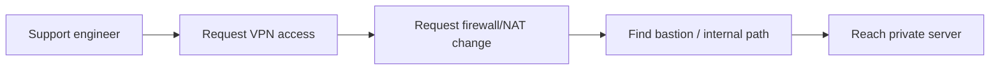
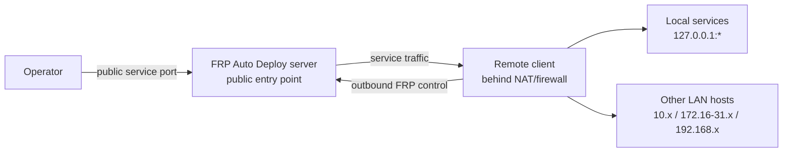
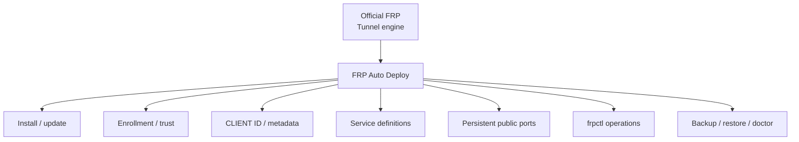

# What is FRP Auto Deploy?

FRP Auto Deploy is a **lightweight deployment and operations layer for official FRP**. It is built for small remote-access environments where a few systems to a few dozen systems need to be reached safely from outside private networks.

<Note>
  **FRP** is the tunnel engine. **FRP Auto Deploy** is the installation, enrollment, identity, service, port, lifecycle, backup, diagnostics, and operator experience around it.
</Note>

## The problem it solves

Without a reverse-tunnel approach, remote support often becomes a chain of infrastructure requests:

For temporary support, labs, partners, branches, and small infrastructure, that process can be much heavier than the actual technical task.

## The operating model

Install the public server once. Remote clients enroll and initiate outbound tunnels toward it.

A client can publish its own services or act as a small gateway for services on other LAN hosts that it can reach.

## Who is it for?

<CardGroup cols={2}>
  <Card title="System administrators" icon="server">
    Reach remote Linux systems without building a full VPN or RMM stack.
  </Card>

  <Card title="Technical support engineers" icon="headset">
    Give customers or partners a controlled one-command onboarding path.
  </Card>

  <Card title="Lab / partner operators" icon="flask">
    Publish a few services from private networks through one controlled public entry point.
  </Card>

  <Card title="Small infrastructure teams" icon="network-wired">
    Manage a few to a few dozen systems with stable identities, ports, and a CLI.
  </Card>
</CardGroup>

## What the product manages

## What it intentionally does not manage

- cloud security groups
- external firewalls or NAT/DNAT rules
- UFW, firewalld, or iptables policy
- DNS provider records
- operating-system accounts, passwords, or SSH keys
- application authentication
- application TLS certificates

Keeping those boundaries explicit makes the product smaller and easier to reason about.

## Supported service model

The stable core publishes **TCP** services:

- SSH
- HTTP
- HTTPS passthrough
- Custom TCP

Each service gets a stable Service ID and a persistent public-port reservation.

## Recommended reading order

1. [Concepts & Mental Model](/getting-started/concepts) — terminology and diagrams
2. [Quick Start](/getting-started/quickstart) — first working connection
3. [Publishing Services](/guides/services) — SSH/web/custom/LAN examples
4. [frpctl Guide](/frpctl/overview) — everyday operation
5. [Architecture](/reference/architecture) — expert internals
