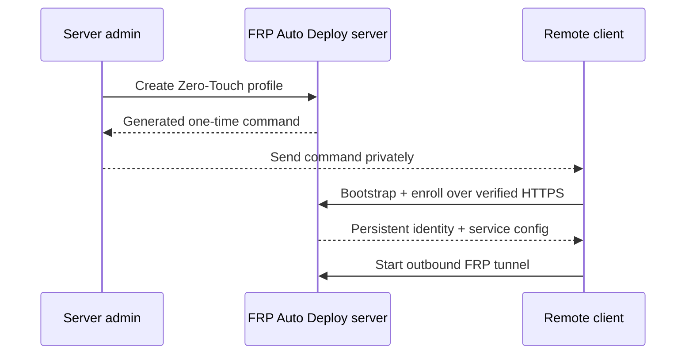

# Zero-Touch Enrollment

Zero-Touch is the recommended onboarding flow when the server administrator wants to define the initial client profile and send the remote user **one command to run**.

## Beginner view



The remote user does not need to understand FRP configuration. They run the exact generated command once.

## Create Zero-Touch

Recommended guided path:

```bash
sudo frpctl
```

Then:

```text
create zero-touch
```

For an explicit SSH one-liner profile:

```bash
sudo frpctl create enrollment \
  --one-line \
  --ssh \
  --ssh-user aella \
  --label branch-a
```

Replace `aella` with an account that already exists on the remote client.

## What it does not do

Zero-Touch does **not**:

- create operating-system users
- install or configure `sshd`
- set passwords
- create or install SSH keys
- change the client firewall
- change external NAT rules

It automates FRP Auto Deploy onboarding, not the operating system's application/security configuration.

## Treat the command as sensitive

The generated command contains or references a short-lived bootstrap credential.

Do not put it in:

- public tickets
- public chat rooms
- shared analytics
- shell-history examples in documentation
- long-lived logs

A Zero-Touch Bootstrap Ticket is designed to be high-entropy, short-lived, first-machine bound, single-use after successful enrollment, and hashed at rest on the server.

## Stable v2.1.2 behavior

The stable release can generate the current Zero-Touch bootstrap form. Always run **exactly what `frpctl` prints** rather than reconstructing it from documentation.

<Accordion title="Development note: shorter URL flow in 2.1.3">
  The 2.1.3 development tree adds an optional operator-managed public bootstrap hostname for a shorter URL such as `https://bootstrap.example.com/i/<opaque-ticket>`. It requires external DNS, publicly trusted TLS, and reverse-proxy configuration. Do not assume it exists on a stable v2.1.2 server.
</Accordion>

## Verify after execution

Server:

```bash
sudo frpctl show clients
sudo frpctl show enrollments
sudo frpctl show client <CLIENT-ID> services
```

Client:

```bash
sudo frpctl show status
sudo frpctl show services
sudo frpctl doctor
```

A successful client receives a persistent CLIENT ID. Normal reboots and supported updates do not require a fresh enrollment.

## Revoke an unused/active enrollment credential

```bash
sudo frpctl revoke enrollment <ID>
```

Revoking an enrollment credential is different from releasing an already-published service port or revoking an enrolled client's management identity.
