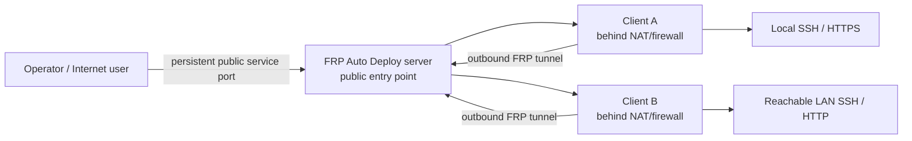
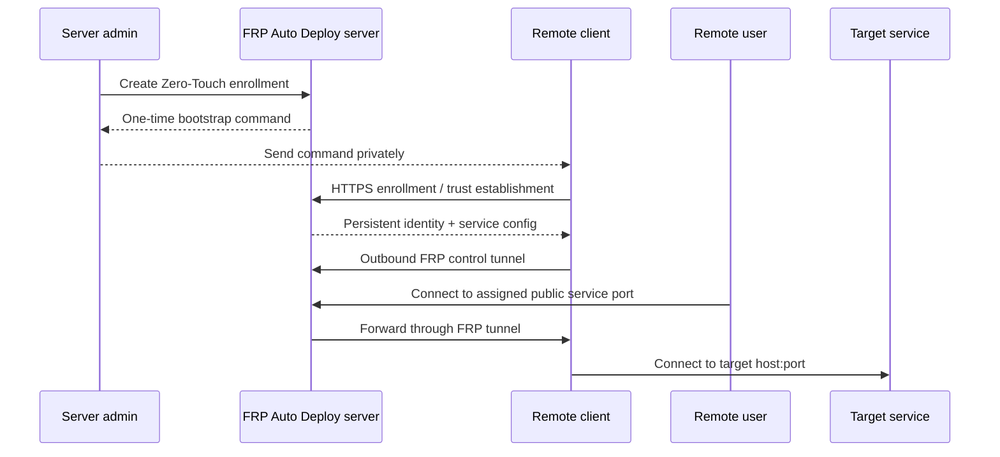

# FRP Auto Deploy

**Reach systems behind NAT and firewalls without building a VPN, opening inbound ports on every remote client, or hand-writing FRP configuration.**

FRP Auto Deploy keeps official `fatedier/frp` as the tunnel engine and adds secure enrollment, persistent identity, service/port management, lifecycle controls, diagnostics, backup/restore, and the `frpctl` operator CLI.

<Note>
  Designed for **a few systems to a few dozen clients**. It is intentionally not a 100+ endpoint fleet-orchestration platform.
</Note>

## Understand it in 30 seconds

The remote client starts the tunnel **outbound** toward the server. That is why the client normally does not need a public IP, inbound NAT rule, or inbound firewall opening for the published service.

## Choose your path

<CardGroup cols={2}>
  <Card title="I am completely new" icon="circle-question" href="/getting-started/concepts">
    Learn Server, Client, CLIENT ID, Service, public port, and the three network paths visually.
  </Card>

  <Card title="I want a working SSH connection" icon="rocket" href="/getting-started/quickstart">
    Follow the shortest end-to-end path from empty server to remote SSH.
  </Card>

  <Card title="I am deploying infrastructure" icon="server" href="/getting-started/server-installation">
    Choose Direct vs single-443, understand required ports, and handle firewall/NAT correctly.
  </Card>

  <Card title="I am onboarding a client" icon="laptop" href="/getting-started/linux-client">
    Choose Zero-Touch or manual Enrollment Code and verify the client.
  </Card>

  <Card title="I need to publish an application" icon="network-wired" href="/guides/services">
    Publish SSH, HTTP, HTTPS passthrough, custom TCP, or another reachable LAN target.
  </Card>

  <Card title="I want expert internals" icon="sitemap" href="/reference/architecture">
    See control plane vs data plane, identity, trust establishment, persistent state, and failure boundaries.
  </Card>
</CardGroup>

## What happens from enrollment to connection

## What you can publish

| Service | Typical target | User connects to |
| --- | --- | --- |
| SSH | `127.0.0.1:22` | `ssh -p <public-port> user@server` |
| HTTP | `127.0.0.1:80` or LAN host | `http://server:<public-port>` |
| HTTPS | `127.0.0.1:443` or LAN host | `https://server:<public-port>` |
| Custom TCP | `host:any-tcp-port` | application-specific client |

One client can publish several services, and a client can also publish services on **other LAN hosts it can reach**.

## Current stable baseline

| Item | Current |
| --- | --- |
| Stable project release | **v2.1.2** |
| Project version on `main` | **2.1.3** development |
| Pinned / tested FRP | **v0.70.1** |
| Stable client scope | **Linux/systemd** |
| Best-documented real-VM baseline | **Ubuntu 22.04 / 24.04** |
| Default deployment | **Direct** |

Windows and macOS automation are development targets and are **not stable-supported in v2.1.2**.

## Four rules that prevent most mistakes

<AccordionGroup>
  <Accordion title="The client usually needs outbound access, not inbound port forwarding">
    The remote client initiates enrollment and the FRP control tunnel toward the public server. The public server/firewall still needs the required inbound ports.
  </Accordion>

  <Accordion title="FRP Auto Deploy does not configure your firewall or DNS provider">
    AWS Security Groups, OCI Security Lists, external NAT, UFW/firewalld/iptables, and DNS records remain infrastructure responsibilities.
  </Accordion>

  <Accordion title="HTTPS publishing is TCP passthrough">
    FRP Auto Deploy does not terminate the published application's TLS. The target application must present a certificate valid for the hostname users actually enter.
  </Accordion>

  <Accordion title="Disable, revoke, and release are intentionally different">
    Disable stops publication but keeps the port. Revoke blocks management identity. Release returns a public-port reservation.
  </Accordion>
</AccordionGroup>

<Tip>
  New user: read [Concepts & Mental Model](/getting-started/concepts), then [Quick Start](/getting-started/quickstart). Experienced operator: jump to [frpctl](/frpctl/overview), [Architecture](/reference/architecture), or [Troubleshooting](/troubleshooting/overview).
</Tip>
