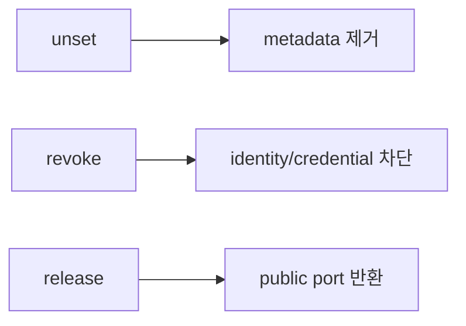

# CLI Reference

이 페이지는 **stable v2.1.2** 기준입니다. `main` 2.1.3 development에는 추가 명령이 있을 수 있습니다.

## 문법

```text
<verb> <resource> [target] [property] [value]
```

Canonical Client selector는 immutable **CLIENT ID**입니다.

## Show

```text
show status
show version
show clients
show client <ID>
show client <ID> services
show client <ID> tags
show enrollments
show audit
show upstream
show services
show info
```

## Set / Unset

```text
set client <ID> label <value>
set client <ID> note <value>
set client <ID> tag <key> <value>
set server hostname <fqdn>

unset client <ID> label
unset client <ID> note
unset client <ID> tag <key>
unset server hostname
```

Client:

```text
set service <service-id> target-host <host>
set service <service-id> target-port <port>
set service <service-id> ssh-user <user>
set service <service-id> name <value>
```

## Create / Add

```text
create zero-touch
create enrollment [--one-line] [--ssh --ssh-user USER --label NAME]
create enrollments --count N
create enrollments --csv clients.csv
create backup [path]
add service [--preset ssh|http|https|custom] ...
```

## Enable / Disable / Apply / Discard

```text
enable service <service-id>
disable service <service-id>
apply
discard
```

## Revoke / Release / Restore

```text
revoke client <ID>
revoke enrollment <ID>
release service <ID> <service-id>
release client <ID>
restore backup <path>
```



서로 alias가 아닙니다.

## Update / 기타

```text
update project [--check]
update frp [--check]
doctor
help
help legacy
?
menu
history
clear
exit
```

<Note>
  `purge enrollment`, `server bootstrap-hostname` 같은 2.1.3 development 기능을 stable v2.1.2 명령으로 가정하지 마세요.
</Note>
