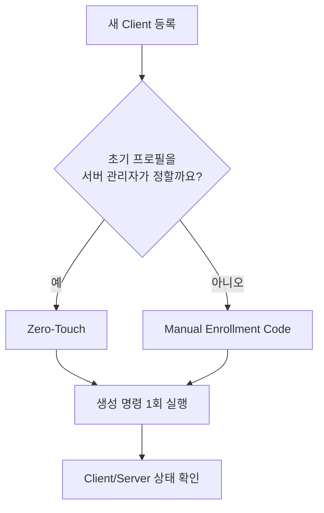
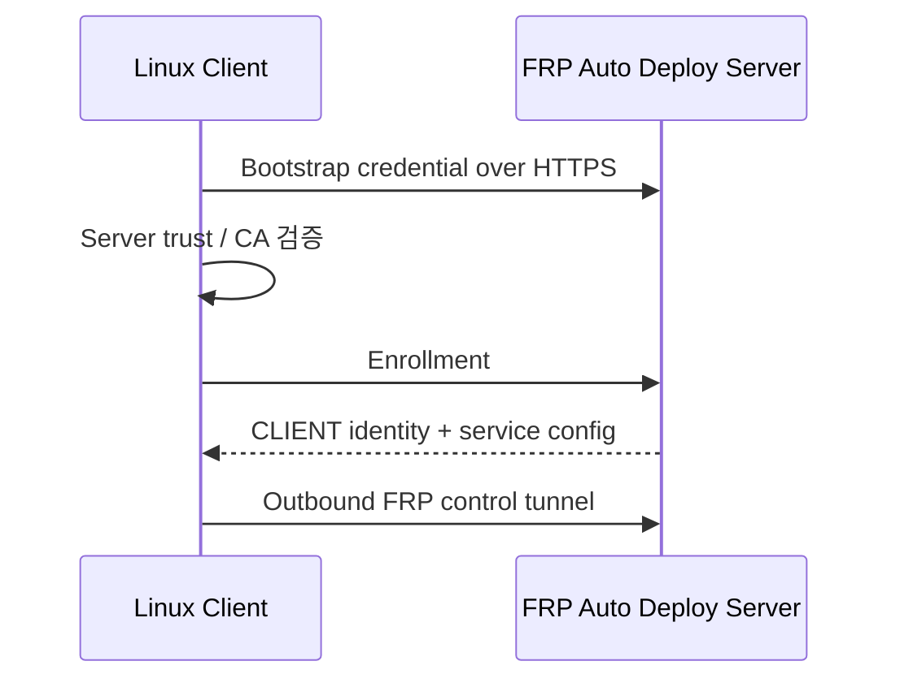

# Linux 클라이언트

현재 stable client 범위는 **Linux/systemd**입니다.

## 등록 전 확인

- `sudo`/root 권한이 있음
- 클라이언트에서 FRP 서버 public endpoint로 outbound 연결 가능
- 게시할 target 서비스가 실제로 실행 중이거나 클라이언트에서 접근 가능
- SSH를 게시한다면 SSH 계정과 `sshd`가 이미 준비됨

FRP Auto Deploy는 OS user/password/SSH key/application service를 자동 생성하지 않습니다.

## 등록 방식을 선택하세요

| 방식 | 적합한 상황 | 초기 서비스 선택 |
| --- | --- | --- |
| **Zero-Touch** | 서버 관리자가 프로필을 미리 정함 | 서버 관리자 |
| **Manual Enrollment Code** | 원격 사용자가 설치 중 서비스를 선택 | 원격 사용자 |



## 권장: Zero-Touch

가장 쉬운 CLI 방식:

```bash
sudo frpctl
```

```text
create zero-touch
```

SSH 프로필을 명시하려면:

```bash
sudo frpctl create enrollment \
  --one-line \
  --ssh \
  --ssh-user aella \
  --label branch-a
```

`aella`는 원격 client에 이미 존재하는 SSH account로 바꾸세요. 서버가 출력한 **정확한 명령을 그대로** client에서 실행합니다.

## Manual Enrollment Code

서버에서:

```bash
sudo frpctl create enrollment
```

생성된 bootstrap 명령을 client에서 실행하고 프롬프트에 단기 Enrollment Code를 입력합니다.

## 등록 과정



## Client에서 확인

```bash
sudo frpctl show version
sudo frpctl show status
sudo frpctl show services
sudo frpctl show info
sudo frpctl doctor
```

## Server에서 확인

```bash
sudo frpctl show clients
sudo frpctl show enrollments
sudo frpctl show client <CLIENT-ID>
sudo frpctl show client <CLIENT-ID> services
```

정상 등록 후에는 일반 재부팅, 지원되는 service edit, 정상 project update 때문에 다시 enrollment할 필요가 없습니다.

## 나중에 서비스 변경

Client service 변경은 staged 상태입니다.

```text
add service
set service <service-id> target-host <host>
set service <service-id> target-port <port>
apply
```

`apply` 전에 취소하려면 `discard`를 사용합니다.

## 꼭 기억할 것

```text
client uninstall != server release
```

Client local software를 지워도 server public-port reservation이 자동 반환되지는 않습니다.
