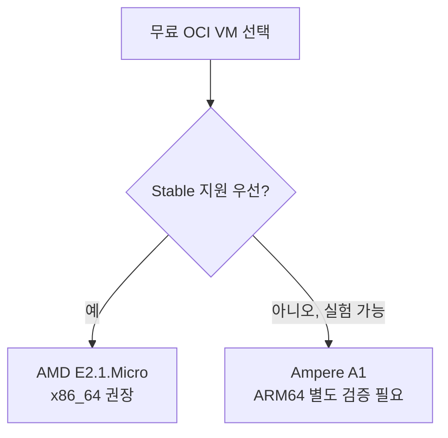
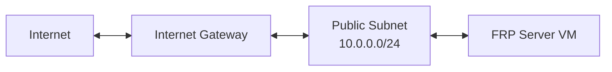
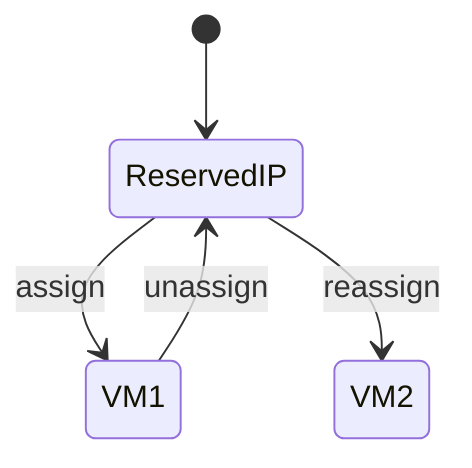
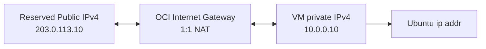
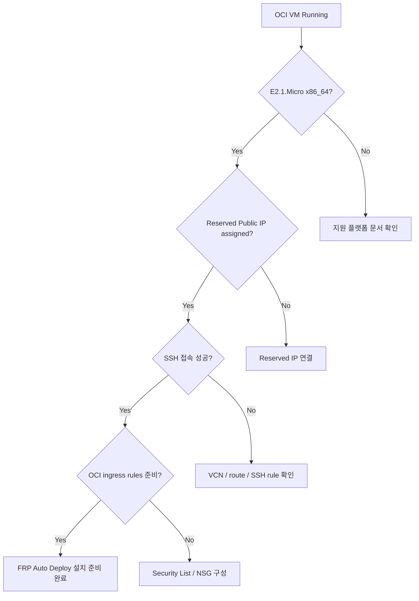

# OCI 무료티어 서버 준비

FRP Auto Deploy 서버에는 **인터넷에서 도달 가능한 공인 진입점**이 필요합니다. 집이나 사무실에 고정 공인 IP가 없거나 별도 VPS 비용이 부담된다면, Oracle Cloud Infrastructure(OCI)의 Always Free 대상 Linux VM을 FRP 서버로 사용할 수 있습니다.

이 페이지의 목표는 **FRP Auto Deploy를 설치하기 전 단계까지** 준비하는 것입니다.


<Check>
  이 구성을 완료하면 별도 도메인이 없어도 `고정 공인 IP + public service port`만으로 FRP Auto Deploy를 사용할 수 있습니다. DNS hostname은 나중에 선택적으로 추가하면 됩니다.
</Check>

## 이 가이드가 해결하는 문제

| 걱정 | 해결 방법 |
| --- | --- |
| 집/회사에 고정 공인 IP가 없음 | OCI **Reserved Public IPv4** 사용 |
| FRP 서버를 둘 Linux가 없음 | OCI **Always Free-eligible VM** 사용 |
| 도메인이 없음 | 처음에는 IP 주소만 사용 가능 |
| 서버 재부팅 후 IP가 바뀔까 걱정 | Reserved Public IP는 instance 수명과 분리된 persistent 객체 |
| NAT/공유기 설정이 어려움 | OCI VM은 public subnet + Internet Gateway로 직접 public entry 제공 |

## 권장 구성

FRP Auto Deploy의 현재 stable 검증 범위를 기준으로 아래 구성을 권장합니다.

| 항목 | 권장 값 | 이유 |
| --- | --- | --- |
| Region | **Tenancy Home Region** | Always Free Compute는 home region에서 생성 |
| Shape | **VM.Standard.E2.1.Micro (AMD/x86_64)** | Always Free 대상이며 stable x86_64 Linux 경로와 가장 잘 맞음 |
| OS Image | **Ubuntu 24.04 LTS x86_64** | FRP Auto Deploy의 real-VM 검증 baseline에 포함 |
| Boot volume | 기본 크기 사용 | Always Free block-volume 한도 안에서 단순하게 유지 |
| Subnet | **Public subnet** | Reserved public IPv4를 VM에 연결하려면 필요 |
| Public IPv4 | **Reserved** | Instance lifecycle과 분리된 고정 주소 |
| SSH | TCP/22, 관리자 IP에서만 허용 권장 | 초기 관리용 |
| FRP Direct | TCP/443, 6099, 서비스 포트 | 기본 배포 경로 |

<Warning>
  OCI의 Free Tier 정책과 계정별 한도는 바뀔 수 있습니다. 생성 화면에서 반드시 **Always Free Eligible** 표시와 예상 비용을 확인하세요. Oracle의 현재 Always Free 문서는 E2.1.Micro AMD VM을 최대 2개까지 제공한다고 설명하지만, 실제 생성 가능 여부는 home region의 capacity와 tenancy 상태에 따라 달라질 수 있습니다.
</Warning>

## 왜 Ampere A1 대신 AMD E2.1.Micro를 권장하나요?

OCI에는 Arm 기반 `VM.Standard.A1.Flex`도 Always Free 옵션이 있습니다. 하지만 FRP Auto Deploy의 stable 문서는 **native ARM64 systemd를 아직 field-validated support로 광고하지 않습니다.**



처음 설치하는 일반 사용자는 **x86_64 E2.1.Micro**를 선택하는 것이 가장 안전합니다.

## 1. OCI 계정과 Home Region 준비

OCI Free Tier 계정을 만들 때 **Home Region**을 신중하게 선택하세요. Always Free Compute는 tenancy의 home region에서 생성해야 합니다.

지역에 따라 Always Free shape capacity가 부족할 수 있습니다. OCI에서 `Out of host capacity`가 표시되면 다른 Availability Domain을 시도하거나 시간이 지난 뒤 다시 시도해야 할 수 있습니다.

<Note>
  무료 계정 생성에는 휴대폰 번호와 카드 확인이 요구될 수 있습니다. Oracle은 사용자가 유료 계정으로 업그레이드하지 않는 한 Free Trial 이후에도 Always Free 대상 리소스를 별도로 구분합니다. 가입/과금 조건은 생성 시점의 OCI Console을 최종 기준으로 확인하세요.
</Note>

## 2. 인터넷 연결 가능한 VCN 만들기

OCI Console에서:

```text
Networking
→ Virtual Cloud Networks
→ Start VCN Wizard
→ VCN with Internet Connectivity
```

간단한 예:

```text
VCN CIDR          10.0.0.0/16
Public subnet     10.0.0.0/24
Private subnet    10.0.1.0/24
DNS resolution    Enabled
```

VCN wizard는 일반적으로 다음 구성요소를 함께 만듭니다.



FRP 서버 VM은 **Public Subnet**에 배치합니다.

## 3. Ubuntu VM 생성

OCI Console에서:

```text
Compute
→ Instances
→ Create instance
```

### Image

권장:

```text
Ubuntu 24.04 LTS
Architecture: x86_64 / AMD
```

### Shape

```text
VM.Standard.E2.1.Micro
Always Free Eligible 표시 확인
```

### Networking

- 방금 만든 VCN 선택
- **Public subnet** 선택
- Primary private IPv4는 자동 할당 가능
- **Assign public IPv4 address는 끄는 것을 권장**

처음부터 ephemeral public IP를 받지 않고, 다음 단계에서 Reserved Public IP를 직접 연결하면 구성이 더 명확합니다.

### SSH key

기존 public key가 있으면 업로드/붙여넣기하고, 없다면 OCI에서 key pair를 생성할 수 있습니다.

<Warning>
  OCI에서 새 key pair를 생성했다면 **private key 파일을 안전하게 보관**하세요. 나중에 다시 다운로드할 수 있다고 가정하면 안 됩니다.
</Warning>

## 4. Reserved Public IPv4 만들기

OCI Console에서:

```text
Networking
→ IP management
→ Reserved public IPs
→ Reserve public IP address
```

예:

```text
Name          frp-server-ip
Compartment   <your compartment>
IP source     Oracle pool (default)
```

Reserved Public IP는 ephemeral IP와 달리 **instance가 종료되어도 IP 객체 자체가 유지**되며, 같은 region의 다른 적절한 private IP로 재할당할 수 있습니다.



## 5. Reserved Public IP를 VM에 연결

OCI 공식 Console 경로는 다음과 같습니다.

```text
Compute
→ Instances
→ <FRP server instance>
→ Networking
→ Attached VNICs
→ <Primary VNIC>
→ IP administration
→ <Primary private IP> ... → Edit
→ Public IP type: Reserved public IP
→ Select Existing Reserved IP Address
→ frp-server-ip 선택
→ Update
```

<Note>
  VNIC의 private IP에 이미 ephemeral 또는 다른 reserved public IP가 연결되어 있으면 먼저 해제해야 합니다.
</Note>

## 6. 왜 Linux에서 공인 IP가 안 보이나요?

OCI의 public IPv4는 VM NIC에 직접 설정되는 주소가 아닙니다. OCI Internet Gateway가 **public IPv4 ↔ VNIC private IPv4** 사이에 1:1 NAT를 제공합니다.



따라서 Ubuntu에서:

```bash
ip addr
```

를 실행했을 때 `10.x.x.x` 같은 private IP만 보이는 것이 정상입니다. 고정 공인 IP는 OCI Console의 VNIC/Public IP 정보에서 확인하세요.

## 7. OCI Security List / NSG 포트 열기

FRP Auto Deploy는 OCI의 Security List 또는 NSG를 자동 변경하지 않습니다.

### 가장 안전한 시작 규칙

| 목적 | Protocol | Port | Source 권장 |
| --- | --- | ---: | --- |
| SSH 관리 | TCP | 22 | **관리자 public IP/32** |
| FRP control (Direct) | TCP | 443 | 필요한 client networks 또는 Internet |
| Enrollment / management (Direct) | TCP | 6099 | 필요한 client networks 또는 Internet |
| Published services | TCP | 6000-6098 | 실제 접속이 필요한 source |

<Warning>
  SSH TCP/22를 `0.0.0.0/0`에 장기간 열어두는 것보다 관리자 IP `/32`로 제한하는 것을 권장합니다.
</Warning>

서비스 포트를 자동 할당하면서 어느 포트가 사용될지 미리 모른다면 `6000-6098` 범위를 열어둘 수 있습니다. 더 엄격한 환경에서는 실제 사용 포트만 열고 서비스가 추가될 때 firewall rule을 함께 갱신하세요.

### Enterprise single-443를 사용할 경우

Public ingress는 보통:

```text
TCP 443         enrollment + FRP control frontend
TCP 6000-6098   published services
```

이고 backend `6099` / `7000`은 loopback-only로 두며 인터넷에 노출하지 않습니다.

## 8. Ubuntu에 SSH 접속

Ubuntu image의 기본 계정은 일반적으로 `ubuntu`입니다.

```bash
chmod 600 <your-private-key>
ssh -i <your-private-key> ubuntu@<RESERVED_PUBLIC_IP>
```

접속되면 다음을 확인합니다.

```bash
uname -m
cat /etc/os-release
systemctl --version
openssl version
```

권장 결과:

```text
Architecture   x86_64
OS             Ubuntu 24.04 LTS
PID 1          systemd
```

## 9. 기본 Linux 업데이트

FRP Auto Deploy 설치 전에 최소한 다음 정도만 준비하면 충분합니다.

```bash
sudo apt update
sudo apt -y upgrade
sudo apt -y install curl ca-certificates
```

시간 동기화도 확인하세요.

```bash
timedatectl status
```

TLS/등록 문제를 피하려면 시스템 시간이 크게 틀어져 있으면 안 됩니다.

Ubuntu의 local firewall 상태도 확인합니다.

```bash
sudo ufw status
```

`ufw`가 active라면 OCI Security List/NSG와 **둘 다** 필요한 포트를 허용해야 합니다. `ufw`가 inactive라면 이 가이드 때문에 새로 활성화할 필요는 없습니다.

## 10. 설치 전 최종 체크



체크리스트:

- [ ] VM이 **Home Region**에 있음
- [ ] Shape에 **Always Free Eligible** 표시 확인
- [ ] Ubuntu 24.04 x86_64 사용
- [ ] Public subnet + Internet Gateway 사용
- [ ] Reserved Public IPv4 연결
- [ ] SSH key 보관 완료
- [ ] 외부에서 SSH 접속 성공
- [ ] OCI Security List/NSG 준비
- [ ] `curl` / CA certificates 설치
- [ ] 시스템 시간 정상

이제 [서버 설치](/ko/getting-started/server-installation)로 이동해 FRP Auto Deploy를 설치하세요.

## 무료 운영 시 알아둘 점

### Idle Always Free instance 회수 정책

Oracle의 현재 Always Free 문서는 **idle compute instance가 회수될 수 있음**을 명시합니다. 문서에는 7일 동안 CPU/network 사용률이 매우 낮고, A1의 경우 memory 사용률도 낮은 인스턴스를 idle로 판단할 수 있다고 설명합니다.

FRP 서버가 아주 가끔만 사용되는 환경이라면 이 정책을 반드시 고려하세요.

<Warning>
  Availability가 중요한 운영용 remote-access gateway라면 Free Tier가 제공하는 비용 이점과 idle/capacity 정책의 리스크를 함께 평가하세요. 인위적으로 의미 없는 부하를 만들어 회수 정책을 피하는 방식은 권장하지 않습니다.
</Warning>

### Free Tier 한도는 바뀔 수 있음

OCI의 Free Tier 안내 페이지와 일부 제품 가격 페이지는 시점에 따라 Ampere A1 무료 한도를 다르게 표시할 수 있습니다. 이 문서에서는 **Always Free Eligible로 표시되는 x86_64 E2.1.Micro**를 권장 경로로 삼고, 생성 직전 OCI Console의 eligibility/cost 표시를 최종 기준으로 사용합니다.

## 다음 단계

<CardGroup cols={2}>
  <Card title="FRP 서버 설치" icon="server" href="/ko/getting-started/server-installation">
    준비된 OCI Ubuntu VM에 stable FRP Auto Deploy를 설치합니다.
  </Card>
  <Card title="방화벽 & NAT" icon="shield-halved" href="/ko/deployment/firewall-nat">
    Public IP, NAT, 서비스 포트 동작을 더 깊게 이해합니다.
  </Card>
</CardGroup>

## 공식 OCI 참고 문서

- [Oracle Cloud Always Free Resources](https://docs.oracle.com/en-us/iaas/Content/FreeTier/freetier_topic-Always_Free_Resources.htm)
- [Launching Your First Linux Instance](https://docs.oracle.com/en-us/iaas/Content/Compute/tutorials/first-linux-instance/overview.htm)
- [Public IP Addresses](https://docs.oracle.com/en-us/iaas/Content/Network/Tasks/managingpublicIPs.htm)
- [Creating a Reserved Public IP](https://docs.oracle.com/en-us/iaas/Content/Network/Tasks/reserved-public-ip-create.htm)
- [Assigning a Reserved Public IP to a Private IP](https://docs.oracle.com/en-us/iaas/Content/Network/Tasks/reserved-public-ip-assign.htm)
- [예약 공용 IP 작동 방식 이해](https://docs.oracle.com/ko/learn/reserved-pub-ip/index.html)
