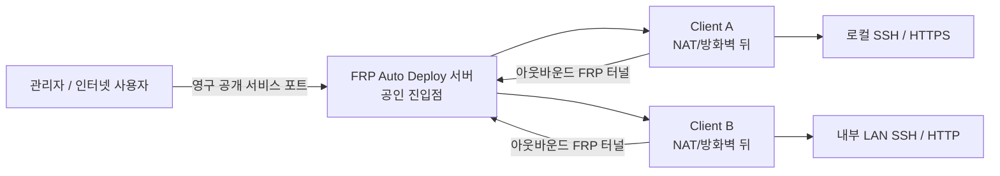
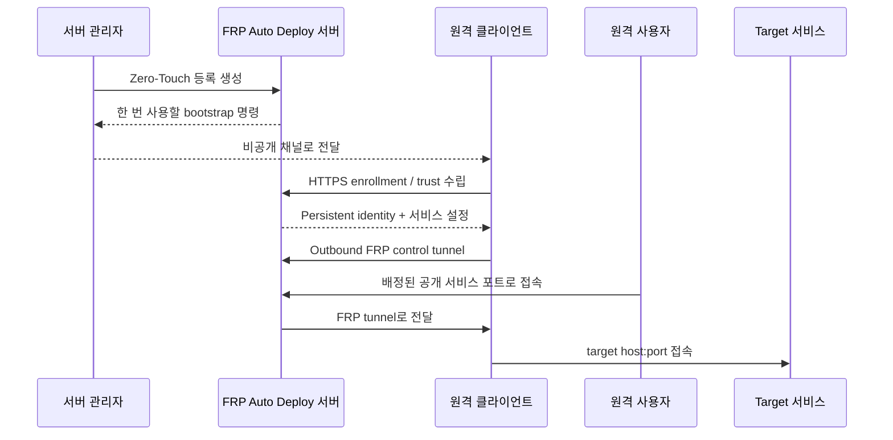

# FRP Auto Deploy

**VPN 구축, 원격 클라이언트의 인바운드 방화벽 개방, 수동 FRP 설정 없이 NAT/방화벽 뒤 시스템에 원격 접속합니다.**

FRP Auto Deploy는 공식 `fatedier/frp`를 터널 엔진으로 그대로 사용하고, 그 위에 안전한 등록, 영구 CLIENT ID, 서비스/포트 관리, lifecycle, 진단, 백업/복구와 `frpctl` 운영 CLI를 추가합니다.

<Note>
  목표 규모는 **몇 대에서 몇십 대 정도**입니다. 수백 대 이상의 fleet orchestration 제품으로 만들려는 프로젝트가 아닙니다.
</Note>

## 30초 만에 이해하기

원격 클라이언트가 서버 쪽으로 **아웃바운드 연결**을 시작합니다. 그래서 일반적인 환경에서는 클라이언트 자체에 공인 IP나 인바운드 NAT/포트포워딩이 필요하지 않습니다.

## 내 상황에 맞게 시작하세요

<CardGroup cols={2}>
  <Card title="FRP/NAT를 잘 모릅니다" icon="circle-question" href="/ko/getting-started/concepts">Server, Client, CLIENT ID, Service, 공개 포트를 그림으로 먼저 이해합니다.</Card>
  <Card title="고정 공인 IP나 무료 서버가 없습니다" icon="cloud" href="/ko/getting-started/oci-free-tier-server">
    OCI Always Free 대상 Ubuntu VM과 Reserved Public IPv4로 FRP 서버용 Linux를 준비합니다.
  </Card>
  <Card title="일단 SSH부터 연결하고 싶습니다" icon="rocket" href="/ko/getting-started/quickstart">빈 서버 준비부터 실제 원격 SSH 성공까지 가장 짧은 절차입니다.</Card>
  <Card title="서버/방화벽을 구성해야 합니다" icon="server" href="/ko/getting-started/server-installation">Direct/single-443, 필요한 포트, NAT 책임 경계를 확인합니다.</Card>
  <Card title="원격 Linux 장비를 붙이려 합니다" icon="laptop" href="/ko/getting-started/linux-client">Zero-Touch와 Manual Enrollment 중 맞는 방식을 고릅니다.</Card>
  <Card title="SSH/웹/LAN 서비스를 게시합니다" icon="network-wired" href="/ko/guides/services">
    한 클라이언트의 여러 서비스와 내부 다른 서버 서비스를 게시합니다.
  </Card>
  <Card title="구조와 보안을 자세히 보고 싶습니다" icon="sitemap" href="/ko/reference/architecture">
    Control/data plane, identity, 신뢰 수립, persistent state를 확인합니다.
  </Card>
</CardGroup>

## 등록부터 실제 접속까지

## 어떤 서비스를 연결할 수 있나요?

| 종류 | 일반적인 Target | 외부 접속 예 |
| --- | --- | --- |
| SSH | `127.0.0.1:22` | `ssh -p <public-port> user@server` |
| HTTP | `127.0.0.1:80` 또는 LAN host | `http://server:<public-port>` |
| HTTPS | `127.0.0.1:443` 또는 LAN host | `https://server:<public-port>` |
| Custom TCP | `host:any-tcp-port` | 애플리케이션별 클라이언트 |

한 클라이언트에 여러 서비스를 등록할 수 있고, 클라이언트가 접근 가능한 **다른 LAN 서버의 서비스**도 게시할 수 있습니다.

## 현재 stable 기준

| 항목 | 현재 |
| --- | --- |
| Stable release | **v2.1.2** |
| `main` 프로젝트 버전 | **2.1.3 development** |
| Pinned / tested FRP | **v0.70.1** |
| Stable client 범위 | **Linux/systemd** |
| 가장 명확한 real-VM baseline | **Ubuntu 22.04 / 24.04** |
| 기본 배포 | **Direct** |

Windows와 macOS 자동화는 개발 대상이며 **v2.1.2 stable 지원 범위가 아닙니다.**

## 가장 많이 헷갈리는 네 가지

<AccordionGroup>
  <Accordion title="클라이언트는 보통 인바운드 포트를 열지 않습니다">
    클라이언트가 enrollment와 FRP control tunnel을 서버 쪽으로 아웃바운드로 시작합니다. 대신 FRP 서버/공인 방화벽은 필요한 public endpoint를 받아야 합니다.
  </Accordion>

  <Accordion title="FRP Auto Deploy가 방화벽/NAT/DNS를 자동 설정하지는 않습니다">
    AWS/OCI 보안 정책, 외부 DNAT, UFW/firewalld/iptables, DNS provider record는 인프라 담당 영역입니다.
  </Accordion>

  <Accordion title="HTTPS는 TLS termination이 아니라 passthrough입니다">
    브라우저가 보는 인증서는 실제 target 애플리케이션의 인증서입니다.
  </Accordion>

  <Accordion title="Disable, Revoke, Release는 서로 다릅니다">
    Disable은 포트를 유지하며 게시만 중지, Revoke는 management identity 차단, Release는 public-port reservation 반환입니다.
  </Accordion>
</AccordionGroup>

<Tip>
  처음이라면 [개념과 동작 원리](/ko/getting-started/concepts) → [빠른 시작](/ko/getting-started/quickstart) 순서로 보는 것이 가장 쉽습니다.
</Tip>
