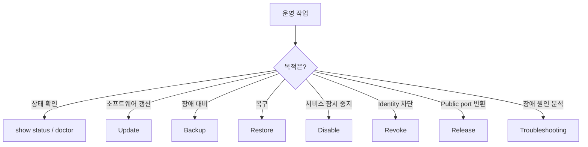
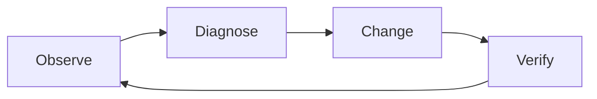

# 운영 개요

일상 운영에서 가장 중요한 원칙은 **먼저 상태를 읽고, 필요한 변경만 수행하고, 변경 뒤 실제 서비스까지 검증하는 것**입니다.

## 어떤 작업을 해야 하나요?

## 안전한 운영 루프

1. **Observe** — `show status`, `show clients`, `show services`로 현재 상태를 확인합니다.
2. **Diagnose** — `doctor`와 네트워크/target reachability를 확인합니다.
3. **Change** — 필요한 최소 변경만 수행합니다.
4. **Verify** — 서버/클라이언트 상태뿐 아니라 실제 public endpoint에서 서비스도 테스트합니다.

<CardGroup cols={2}>
  <Card title="업데이트" icon="arrows-rotate" href="/ko/operations/updates">
    Project와 bundled relay engine를 안전하게 갱신합니다.
  </Card>
  <Card title="백업 & 복구" icon="database" href="/ko/operations/backup-restore">
    CA, token, registry와 reservation을 보호합니다.
  </Card>
  <Card title="진단 & Doctor" icon="stethoscope" href="/ko/operations/diagnostics">
    Read-only evidence를 먼저 수집합니다.
  </Card>
  <Card title="Lifecycle 의미" icon="diagram-project" href="/ko/operations/lifecycle">
    Disable, revoke, release의 차이를 이해합니다.
  </Card>
  <Card title="문제 해결" icon="wrench" href="/ko/operations/troubleshooting">
    증상에서 원인 계층으로 좁혀갑니다.
  </Card>
</CardGroup>

<Warning>
  Registry, PKI, generated relay configuration을 일반 장애 대응의 첫 단계로 직접 수정하지 마세요. 먼저 `doctor`와 공식 lifecycle 명령을 사용하세요.
</Warning>
