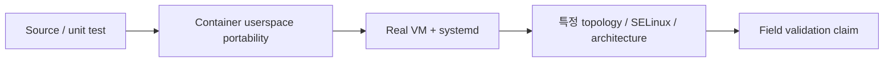

# 지원 플랫폼 & 제한

현재 published stable은 **FRP Auto Deploy v2.1.2**, pinned FRP는 **v0.70.1**입니다.

## 가장 중요한 구분

**Container portability PASS와 real VM/systemd/SELinux field validation은 같은 의미가 아닙니다.**

낮은 단계의 테스트 결과를 더 강한 support claim으로 올려서 표현하면 안 됩니다.

## Stable Client 범위

현재 stable product scope는 **Linux/systemd**입니다.

처음 설치하는 사용자가 가장 애매함 없이 선택할 baseline은 **Ubuntu 22.04 / 24.04 x86_64**입니다.

## v2.1.2 Validation 분류

| 환경 | Stable v2.1.2 기준 claim |
| --- | --- |
| Ubuntu 22.04 / 24.04 real VM | **Required stable baseline, documented PASS** |
| Ubuntu 24.04 x86_64 single-443 / enterprise-restricted path | **Real E2E PASS** |
| Rocky Linux 9 container | automated userspace/container PASS |
| AlmaLinux 9 container | automated userspace/container PASS |
| Amazon Linux 2023 container | automated userspace/container PASS |
| Amazon Linux 2 container | automated userspace/container PASS |
| Rocky Linux 9 real VM | **NOT_TESTED** stable validation, full VM support로 광고하지 않음 |
| Rocky/Alma SELinux Enforcing | **NOT_TESTED** stable validation |
| Amazon Linux 2023 real VM | **NOT_TESTED** stable validation |
| Amazon Linux 2 real VM / systemd 219 / real TTY | **NOT_TESTED** stable validation |
| Native ARM64 systemd | architecture mapping 수준 검증, stable real-systemd gate 미확정 |
| Real OpenSSL 1.0.2 TLS enrollment | **NOT_TESTED** stable real-host gate |

<Note>
  `main` development tree에는 v2.1.2 이후 추가 Real E2E 결과가 존재할 수 있습니다. 이 페이지는 운영 사용자가 혼동하지 않도록 **immutable stable v2.1.2 claim**을 우선 표시합니다.
</Note>

## Windows / macOS

Windows와 macOS Client automation은 개발 대상이지만 **v2.1.2 stable 지원 범위가 아닙니다.**

Lab/E2E에서 성공했다는 사실만으로 stable field support로 표시하지 않습니다.

## Server 범위

FRP Auto Deploy Server는 Linux 기반입니다. Windows server는 현재 product scope가 아닙니다.

## 환경에 따라 별도 검증이 필요한 항목

- SELinux Enforcing
- Native ARM64 systemd
- 오래된 OpenSSL/system library
- Direct public-IP vs firewall/DNAT
- Enterprise TLS interception/reset
- 실제 reboot + persistent systemd state

새 환경을 검증할 때 Server/Client 양쪽에서 `sudo frpctl doctor`를 사용하세요.

## 제품 운영 규모

지원 OS와 무관하게 제품 목표는 **몇 대에서 몇십 대**입니다. 수백/수천 endpoint orchestration은 현재 목표가 아닙니다.

## 기타 Stable 제한

- TCP service 중심
- 외부 firewall/NAT/cloud security policy 자동 설정 없음
- OS account/password/SSH key 자동 관리 없음
- HTTPS publish는 TLS termination이 아니라 passthrough
- bootstrap script는 checksum 검증 대상이지만 project 자체 cryptographic signature는 현재 제공하지 않음
