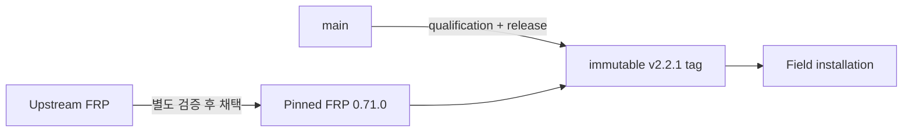

# 릴리스 상태

FRP Auto Deploy는 **immutable stable release**와 mutable `main` branch를 구분합니다.

## 현재 기준

| 항목 | 현재 |
| --- | --- |
| Published stable release | **v2.2.1** |
| Project version | **2.2.1** |
| Pinned/tested FRP | **v0.71.0** |
| Field install 기준 | immutable `v2.2.1` tag |
| Release commit | `19d4b6fb8a9bee2d477ace6f5c3ed70310e7ea8f` |
| Qualified candidate | `2140be5b6342c3651c16a458f8ea1bc9b577d992` |
| Full Real E2E | **동일 exact candidate HEAD에서 PASS / PASS** |

Qualified candidate와 v2.2.1 release tree는 동일했습니다. 이미 공개된 v2.2.0은 historical release로 그대로 유지되며 retag하지 않았습니다.

## Canonical 문서 복구 종료

Post-release 문서 복구 단계 `CANONICAL_PRODUCT_MASTER_RESTORE_V2_2_1_DOCS_CLOSURE`는 **PASS**로 종료됐습니다.

| 항목 | 결과 |
| --- | --- |
| Docs closure 이후 최종 repository `main` HEAD | `343f292d91d01c3f263ff5c443f101d185b5527f` |
| v2.2.1 release commit | `19d4b6fb8a9bee2d477ace6f5c3ed70310e7ea8f` |
| v2.2.1 tag target 변경 | **NO** |
| v2.2.0 tag 변경 | **NO** |
| 새 release 생성 | **NO** |
| Product runtime file 변경 | **NO** |
| Real E2E 재실행 필요 | **NO** |
| Canonical Product Master 복구 | **PASS** |
| Product Master structural check | **PASS** |
| Current release/platform matrix 업데이트 | **YES** |
| Release history 보존 | **YES** |
| Provenance 추가 | **YES** |
| Known corruption 제거 | **YES** |
| Public metadata scan | **PASS** |
| Secret scan | **PASS** |
| `SHA256SUMS` 업데이트 | **YES** |
| 최종 문서 상태 | **CANONICAL** |

손상/축약된 2,173-line derivative는 **PR #12**를 통해 Owner-reconstructed full integrated Product Master(약 3,625 lines)로 교체됐습니다. 복구된 authoritative 문서는 `docs/PRODUCT_MASTER.md`이며, 불완전한 surgical PR #13은 superseded 상태로 종료됐습니다.

문서-only merge로 repository `main`은 v2.2.1 release commit에서 `343f292…`까지 전진했지만 immutable v2.2.1 tag와 release payload는 변경하지 않았습니다. 따라서 stable install identity는 계속 \*\*v2.2.1 / `19d4b6f…`\*\*이고 repository `main` HEAD만 더 최신입니다.

<Note>
  `docs/GITHUB_SETUP.md`의 stale-state 정리는 이번 closure에서 완료되지 않았습니다(`GITHUB_SETUP_STALE_STATE_FIXED=NO`). 이는 문서 follow-up이며 v2.2.1 runtime, release tag, 검증된 platform claim에는 영향을 주지 않습니다.
</Note>



## 운영 설치는 stable tag 사용

```bash
curl -fsSL \
  https://raw.githubusercontent.com/datarelay-labs/frp-auto-deploy/v2.2.1/dist/bootstrap-server.sh \
  | sudo bash
```

일반 field 설치에서는 mutable `main` 대신 immutable stable tag를 사용합니다.

## FRP version 정책

FRP Auto Deploy는 upstream 최신 버전을 자동으로 따라가지 않습니다. Project에서 검증된 FRP version을 pinned 상태로 사용합니다.

현재 pinned FRP:

```text
0.71.0
```

`show upstream`은 정보용이며 newest upstream binary를 자동 채택하는 의미가 아닙니다.

## 현재 Stable 플랫폼

v2.2.1에서는 **Ubuntu 24 physical, Rocky Linux 8.10, Rocky Linux 9.4, Amazon Linux 2023, macOS Apple Silicon, Windows 10 / PowerShell 5.1**이 Real E2E 검증됐습니다.

Amazon Linux 2는 **Container/CI portability만**, PowerShell 7은 **CI 검증**으로 구분합니다. 정확한 matrix는 [지원 플랫폼 & 제한](/ko/reference/platforms)을 확인하세요.
