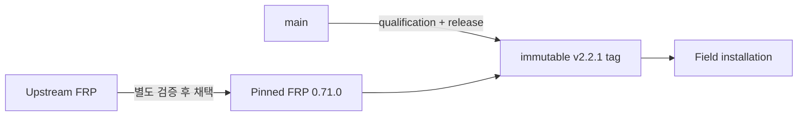

# 릴리스 상태

FRP Auto Deploy는 **immutable stable release**와 mutable `main` branch를 구분합니다.

## 현재 기준

| 항목 | 현재 |
| --- | --- |
| Published stable release | **v2.2.1** |
| Project version | **2.2.1** |
| Pinned/tested FRP | **v0.71.0** |
| Field install 기준 | immutable `v2.2.1` tag |
| Release commit | `19d4b6fb8a9bee2d477ace6f5c3ed70310e7ea8f` |
| Qualified candidate | `2140be5b6342c3651c16a458f8ea1bc9b577d992` |
| Full Real E2E | **동일 exact candidate HEAD에서 PASS / PASS** |

Qualified candidate와 v2.2.1 release tree는 동일했습니다. 이미 공개된 v2.2.0은 historical release로 그대로 유지되며 retag하지 않았습니다.



## 운영 설치는 stable tag 사용

```bash
curl -fsSL \
  https://raw.githubusercontent.com/datarelay-labs/frp-auto-deploy/v2.2.1/dist/bootstrap-server.sh \
  | sudo bash
```

일반 field 설치에서는 mutable `main` 대신 immutable stable tag를 사용합니다.

## FRP version 정책

FRP Auto Deploy는 upstream 최신 버전을 자동으로 따라가지 않습니다. Project에서 검증된 FRP version을 pinned 상태로 사용합니다.

현재 pinned FRP:

```text
0.71.0
```

`show upstream`은 정보용이며 newest upstream binary를 자동 채택하는 의미가 아닙니다.

## 현재 Stable 플랫폼

v2.2.1에서는 **Ubuntu 24 physical, Rocky Linux 8.10, Rocky Linux 9.4, Amazon Linux 2023, macOS Apple Silicon, Windows 10 / PowerShell 5.1**이 Real E2E 검증됐습니다.

Amazon Linux 2는 **Container/CI portability만**, PowerShell 7은 **CI 검증**으로 구분합니다. 정확한 matrix는 [지원 플랫폼 & 제한](/ko/reference/platforms)을 확인하세요.
