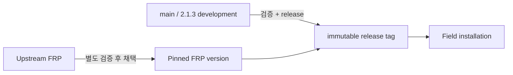

# 릴리스 상태

FRP Auto Deploy는 **immutable stable release**와 **mutable development branch**를 구분합니다.

## 현재 기준

| 항목 | 현재 |
| --- | --- |
| Published stable release | **v2.1.2** |
| `main` project version | **2.1.3** |
| Pinned/tested FRP | **v0.70.1** |
| Field install 기준 | immutable `v2.1.2` tag |



## 운영 설치는 stable tag 사용

```bash
curl -fsSL \
  https://raw.githubusercontent.com/datarelay-labs/frp-auto-deploy/v2.1.2/dist/bootstrap-server.sh \
  | sudo bash
```

`main`은 다음 release를 위한 development channel이므로 일반 field 설치 문서에서 stable과 섞지 않습니다.

## FRP version 정책

FRP Auto Deploy는 upstream 최신 버전을 자동으로 따라가지 않습니다. Project에서 검증된 FRP version을 pinned 상태로 사용합니다.

현재 pinned FRP:

```text
0.70.1
```

`show upstream`은 정보용이며 newest upstream binary를 자동 채택하는 의미가 아닙니다.

## 지원 표현도 release 기준

Stable product scope와 lab/E2E/development 결과를 구분합니다. Windows/macOS automation이나 특정 Linux 환경이 실험에서 성공했다고 해서 stable field support로 자동 승격되는 것은 아닙니다.

<Tip>
  현재 환경의 support 수준은 [지원 플랫폼 & 제한](/ko/reference/platforms)에서 확인하세요.
</Tip>
