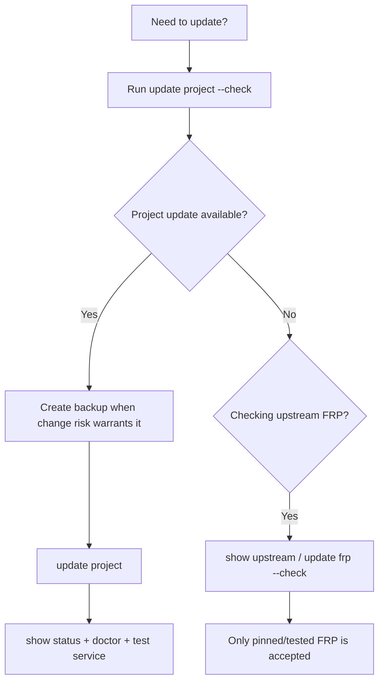
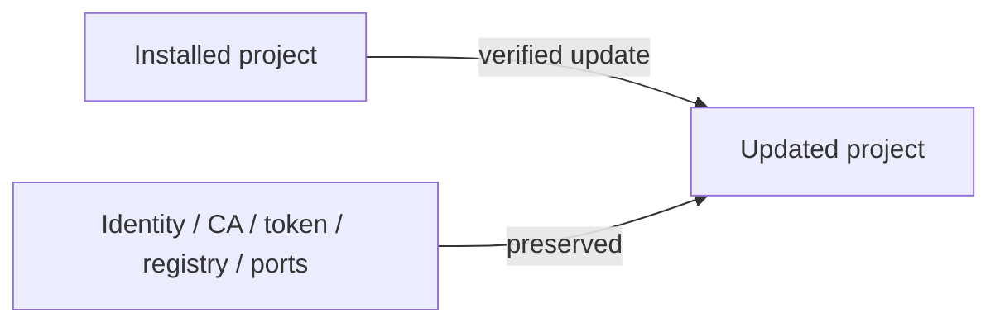
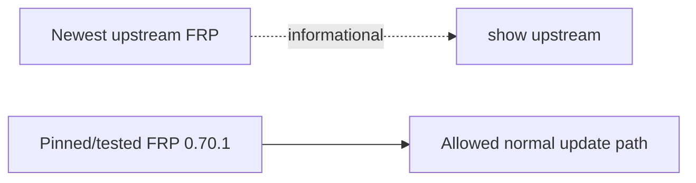

# Updates

FRP Auto Deploy separates **project updates** from **upstream FRP binary updates**.

## Update decision flow



## Project update

Check first:

```bash
sudo frpctl update project --check
```

Then update:

```bash
sudo frpctl update project
```

A normal supported project update is designed to preserve:

- CLIENT ID and client management identity
- project private CA
- FRP token
- registry state
- enrollment state where applicable
- service definitions
- persistent public service-port reservations



A normal update is **not** a re-enrollment operation.

## Stable release vs development `main`

| Channel | Meaning | Recommended use |
| --- | --- | --- |
| **v2.1.2 immutable tag** | current published stable | field/normal installation |
| **main = 2.1.3** | mutable development channel | intentional development/testing only |

Do not copy a development-only command into stable field documentation unless the operator explicitly opted into development behavior.

## FRP binary update

```bash
sudo frpctl show upstream
sudo frpctl update frp --check
```

`show upstream` is informational. FRP Auto Deploy does **not** automatically install the newest upstream FRP release. The project remains pinned to the version it has tested, currently **v0.70.1**.



## Same-version refreshes

Update decisions are not based only on the visible project version string. Verified release metadata and bundle SHA256 can distinguish changed builds even when the project version text is unchanged.

## After any update

```bash
sudo frpctl show version
sudo frpctl show status
sudo frpctl doctor
```

Then test at least one representative published service through its public endpoint.

<Warning>
  Do not manually replace `frps`/`frpc` with an arbitrary newer upstream binary just because `show upstream` reports one. The tested/pinned FRP policy is part of release safety.
</Warning>
