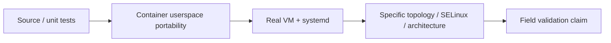

# Supported Platforms

Current published stable release: **FRP Auto Deploy v2.1.2** with pinned FRP **v0.70.1**.

## The most important distinction

A **container portability PASS is not the same as a real-VM/systemd/SELinux field validation**.

Documentation should never promote a lower-level test into a stronger support claim.

## Stable client scope

The stable product scope is **Linux/systemd**.

For a new user who wants the least ambiguous baseline, Ubuntu 22.04/24.04 x86_64 has the strongest documented real-VM validation in the stable line.

## v2.1.2 validation classification

| Environment | Validation level / current claim |
| --- | --- |
| Ubuntu 22.04 / 24.04 real VM | **Required stable baseline; documented PASS** |
| Ubuntu 24.04 x86_64 single-443 / enterprise-restricted client path | **Real E2E PASS** |
| Rocky Linux 9 container | automated userspace/container PASS |
| AlmaLinux 9 container | automated userspace/container PASS |
| Amazon Linux 2023 container | automated userspace/container PASS |
| Amazon Linux 2 container | automated userspace/container PASS |
| Rocky Linux 9 real VM | **NOT_TESTED in v2.1.2 stable validation; do not advertise full VM support** |
| Rocky/Alma SELinux Enforcing | **NOT_TESTED** in stable validation |
| Amazon Linux 2023 real VM | **NOT_TESTED** in stable validation |
| Amazon Linux 2 real VM / systemd 219 / real TTY | **NOT_TESTED** in stable validation |
| Native ARM64 systemd | architecture mapping tested, real-systemd gate not proven in this stable classification |
| Real OpenSSL 1.0.2 TLS enrollment | **NOT_TESTED** stable real-host gate |

<Note>
  The development tree may contain newer Real E2E evidence than the immutable v2.1.2 release. This page intentionally describes the **stable release claim**, not every later lab result on `main`.
</Note>

## Windows and macOS

Windows and macOS client automation are development targets, but they are **not stable-supported in v2.1.2**.

A successful lab/E2E experiment should not be presented as a stable field-support claim until a stable release explicitly promotes that platform.

## Server scope

The FRP Auto Deploy server is Linux-based. A Windows FRP Auto Deploy server is outside the current product scope.

## Real-environment factors that can change behavior

- SELinux Enforcing
- native ARM64 systemd
- older OpenSSL/system libraries
- direct public-IP vs firewall/DNAT topology
- enterprise TLS interception/reset behavior
- real reboot and persistent systemd state

Use `sudo frpctl doctor` on both server and client when validating a new environment.

## Product scale

Platform support does not change the intended management scale: **a few systems to a few dozen clients**, not hundreds/thousands of managed endpoints.
